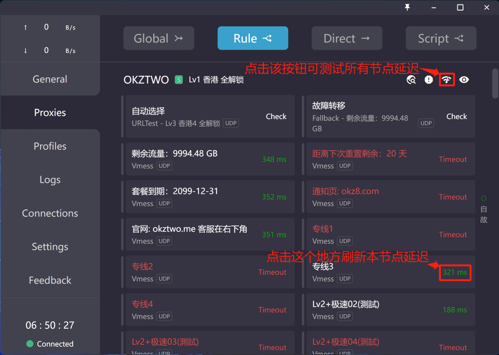

# Clash 使用教程

## 安装步骤

- [ClashForWindows](https://github.com/Fndroid/clash_for_windows_pkg)
- [ClashForAndroid](https://github.com/Kr328/ClashForAndroid)
- 使用默认安装即可。

## 订阅地址

- 有订阅地址的使用已有的地址即可。
- 无订阅地址的可以参考[OKZTWO(clash 超稳定节点)](https://github.com/luohaha66/Clash_Node_OKZTWO)。

## 使用说明

  

  

  

## 使用技巧

- 对于不需要代理的网站，选择`Settings->System Proxy->Bypass Domain/IPNet->Edit`，添加无需代理的网址即可。
- 当网络不稳定时，可以对节点进行延迟测试，选则延迟最低的节点使用。

  
